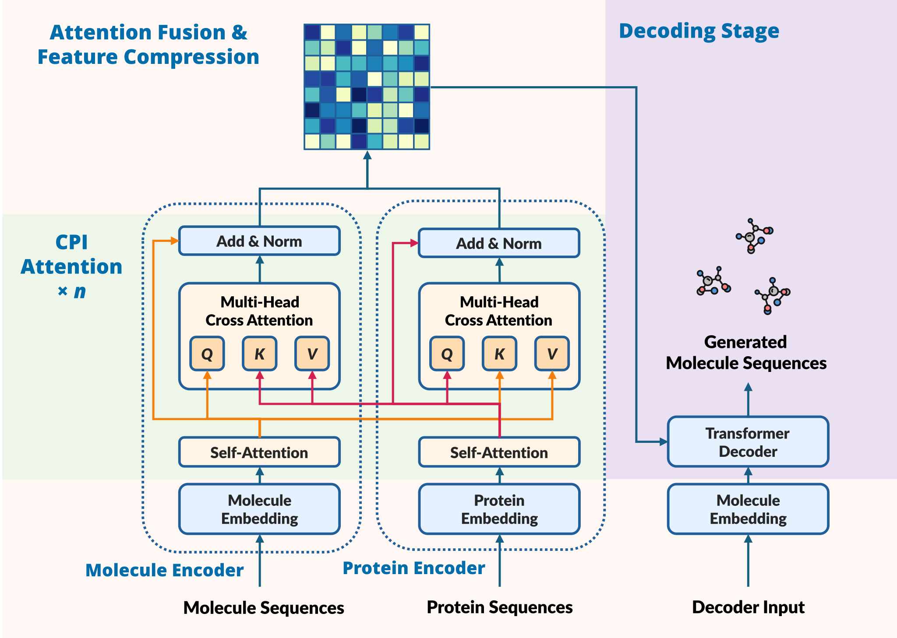

# Moot: Matched Molecular Pair Oriented Optimization Transformer

**Moot** is a molecular optimization model based on the Transformer. This model takes the sequences of molecule before optimization and the target as inputs and generates the optimized molecule.



## Quick Start

Moot provides a user-friendly Web APP. This section introduces how to launch the Moot project by deploying the Web APP.

### 1. Install Environment

You can install project dependencies via either [PDM](https://pdm-project.org/en/latest/) or PIP.

#### 1.1 PDM

Make sure PDM has installed in your device. Modify the url value of `torch-cuda` in `pyproject.toml` based on the CUDA version of your running environment. After entering the corresponding environment, install dependencies with the following command:

```shell
$ pdm install
```

#### 1.2 PIP

Modify the PyTorch download link in `requirements.txt` based on the CUDA version of your running environment. After entering the corresponding environment, install dependencies with the following command:

```shell
$ pip install -r requirements.txt
```

### 2. Download Models

```shell
$ wget -O checkpoints/platform/end_to_end.pt "https://ljpgroup-public.obs.cn-north-305.tjaicc.com/Moot/checkpoints/platform/end_to_end.pt"
$ wget -O checkpoints/platform/step_by_step.pt "https://ljpgroup-public.obs.cn-north-305.tjaicc.com/Moot/checkpoints/platform/step_by_step.pt"
```

### 3. Run Server

```shell
$ cd web && python app.py
...
Moot Application URL: http://127.0.0.1:5000/app/index.html
 * Serving Flask app 'app'
 * Debug mode: on
WARNING: This is a development server. Do not use it in a production deployment. Use a production WSGI server instead.
 * Running on http://127.0.0.1:5000
Press CTRL+C to quit
```

After starting the server via the above commands and displaying the above information, the service is successfully running. You can access and use Moot's Web APP in a browser via `http://127.0.0.1:5000/app/index.html`.

## Supplements

### Dataset & Checkpoints

| Datasets                                                                                         | Introduction URL                                             |
| ------------------------------------------------------------------------------------------------ | ------------------------------------------------------------ |
| [finetune.tar.gz](https://ljpgroup-public.obs.cn-north-305.tjaicc.com/Moot/data/finetune.tar.gz) | MMP records in SMILES and SELFIES format                     |
| [frag.tar.gz](https://ljpgroup-public.obs.cn-north-305.tjaicc.com/Moot/data/frag.tar.gz)         | MMP records with fragments data in SMILES and SELFIES format |

| Models                                                                                                                      | Introduction                         |
| --------------------------------------------------------------------------------------------------------------------------- | ------------------------------------ |
| [optformer_smiles.pt](https://ljpgroup-public.obs.cn-north-305.tjaicc.com/Moot/checkpoints/optformer_smiles.pt)             | end-to-end Moot trained with SMILES  |
| [optformer_selfies.pt](https://ljpgroup-public.obs.cn-north-305.tjaicc.com/Moot/checkpoints/optformer_selfies.pt)           | end-to-end Moot trained with SELFIES |
| [frag_optformer_smiles.pt](https://ljpgroup-public.obs.cn-north-305.tjaicc.com/Moot/checkpoints/frag_optformer_smiles.pt)   | Frag-Moot trained with SMILES        |
| [frag_optformer_selfies.pt](https://ljpgroup-public.obs.cn-north-305.tjaicc.com/Moot/checkpoints/frag_optformer_selfies.pt) | Frag-Moot trained with SELFIES       |

_\* Note: Optformer is an alias of Moot._

### Training or Inference

If executing model training or inference via scripts, the scripts will first read the task configuration information from the YAML files in `scripts/tasks`. Therefore, you can customize the training or inference process by writing task YAML files.

A task YAML file has the value `task_name`:

```yaml
task_name: train_optformer_smiles
```

The command accepts the `task_name` parameter to read the specified configuration and start training:

```shell
$ cd scripts
$ python train_optformer.py <task_name>
```

Or use the inference command:

```shell
$ cd scripts
$ python infer_optformer.py <task_name>
```

The scripts directory provides training scripts for models such as Transformer, Moot, Frag-Transformer, and Frag-Moot.
